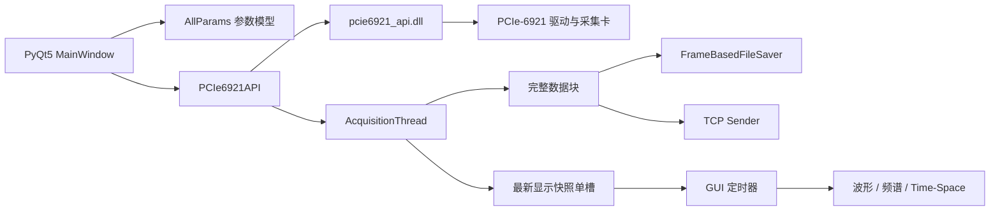
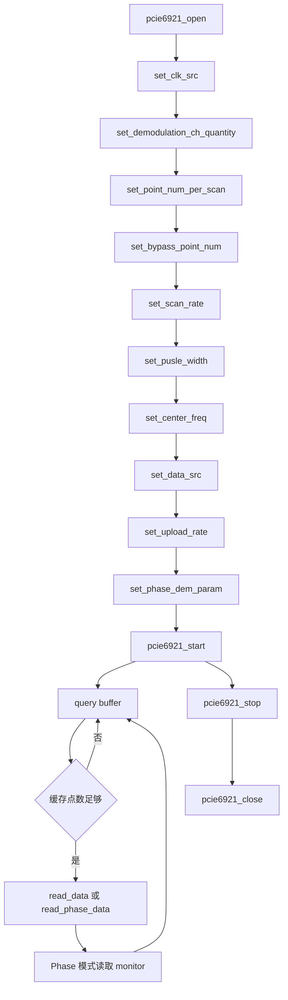
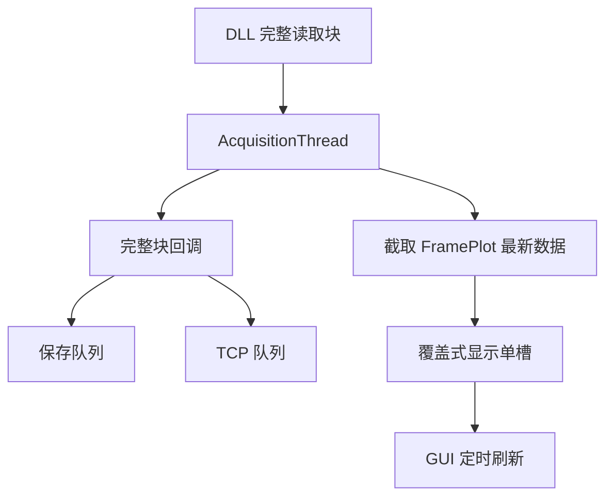

# 2026-6-14 PCIe-6921 上位机开发日志

## 1. 工作目标

本次工作目标是使用指定的 64 位 DLL：

`E:\codes\PCIe-6921\windows_Issue\dll\x64\pcie6921_api.dll`

参考 `PCIe6921上位机开发方案.md`、`PCIe7821和6921 API调用流程和方式对比.md`、厂家头文件以及 `E:\codes\PCIe-7821\pcie7821_gui` 项目，完成可运行、可仿真、可继续带卡联调的 PCIe-6921 模块化上位机。

## 2. 开发思路

本次没有重新设计整套桌面软件，而是采用“复用稳定上层，隔离设备差异”的策略：

1. 复用 7821 已验证的 GUI、采集线程、最新显示快照、异步写盘、频谱、Time-Space 和 TCP 发送模块。
2. 在 `config.py` 中集中表达 6921 的枚举、约束和物理距离换算。
3. 在 `pcie6921_api.py` 中集中处理 DLL 原型、4 KB DMA 对齐、锁和 NumPy 数据类型。
4. 在 `main_window.py` 中只保留设备配置编排与 GUI 参数联动，不向其他模块泄漏 ctypes 细节。
5. 通过无卡仿真与自动化测试先验证软件链路，带卡环境再验证硬件时序和实际数据排列。

## 3. 软件架构

架构中的关键边界如下：

- `PCIe6921API` 是唯一直接调用 DLL 的模块。
- `AcquisitionThread` 只消费 Python API，并输出 NumPy 数组。
- 保存和 TCP 消费完整数据块，不依赖 GUI 是否及时刷新。
- GUI 只消费最新显示快照，旧快照可以覆盖，以防大数组在 Qt 事件队列中积压。

## 4. 6921 API 调用流程

实际配置顺序按厂家流程和对比文档实现：

## 5. 参数模型与公式

### 5.1 上传速率与点距

6921 的 `upload_rate` 同时控制 PC 上传速率与 Phase 解调输入速率，因此不再向 DLL 传入独立 `rate2phase`。单点空间距离为：

$$
d(upload\_rate) =
\begin{cases}
0.4\ \mathrm{m}, & upload\_rate=1 \\
0.8\ \mathrm{m}, & upload\_rate=2 \\
1.2\ \mathrm{m}, & upload\_rate=3 \\
1.6\ \mathrm{m}, & upload\_rate=4 \\
2.0\ \mathrm{m}, & upload\_rate=5
\end{cases}
$$

Phase 合并后的空间点距为：

$$
\Delta x_{phase} = d(upload\_rate) \times space\_merge\_point\_num
$$

### 5.2 单次读取块大小

Raw 数据类型为 `int16`，双 ADC 模式下单次读取块大小为：

$$
B_{raw} = Points \times FrameLoad \times 2 \times 2
$$

Phase 数据类型为 `int32`，合并后每帧点数为：

$$
PhasePoints = \frac{Points}{MergePointNum}
$$

Phase 单次读取块大小为：

$$
B_{phase} = PhasePoints \times FrameLoad \times Channels \times 4
$$

读取块覆盖的采集时间为：

$$
T_{block} = \frac{FrameLoad}{ScanRate}
$$

这些公式用于估算内存、磁盘吞吐、单次 DLL 读取时延上限和停滞检测阈值。

## 6. 关键实现

### 6.1 DLL 适配层

`src/pcie6921_api.py` 完成以下工作：

- 自动从 `libs/pcie6921_api.dll` 查找并加载 DLL。
- 严格按厂家头文件声明 `ctypes.restype` 与 `ctypes.argtypes`。
- 使用 `AlignedBuffer` 分配 4096 字节对齐内存。
- Raw 使用 `np.int16`，Phase 使用 `np.int32`，Monitor 使用 `np.uint32`。
- 使用互斥锁串行化 DLL 调用。
- 配置接口和缓冲查询接口统一检查返回码，失败时抛出 `PCIe6921Error`。
- Raw/Phase 短读时只返回 DLL 实际写入区域，避免上次读取残留数据进入上层。
- 将返回数据复制为独立 NumPy 数组，避免后续读取覆盖正在被消费的数据。

### 6.2 6921 参数约束

`src/config.py` 和主窗口校验实现了以下规则：

- 时钟源编码：`0=外部`、`1=内部`。
- Raw 固定双 ADC 通道。
- 解调通道数只允许 `1` 或 `2`。
- Raw 或单路解调最大 `131072` 点，按 `256` 点对齐。
- 双路解调最大 `65536` 点，按 `128` 点对齐。
- Phase 最大 `65536` 点，不要求 `128/256` 点对齐。
- Phase 的 `Points` 必须能被 `MergePointNum` 整除。
- `space_region_diff_order` 限制为 `1~8`。
- 脉冲宽度限制为 `4 ns` 的整数倍。

### 6.3 GUI 差异处理

- 触发方向控件保留用于解释界面布局，但已禁用并固定为输出流程，因为 6921 DLL 不提供 `set_trig_dir`。
- `Rate2Phase` 控件保留为只读显示，并与 `DataRate` 同步，因为 6921 只有统一上传速率。
- 切换到 Raw 时自动选择并锁定双通道；离开 Raw 后恢复解调通道选择。
- 其他显示、保存、频谱、Time-Space 和 TCP 交互保持 7821 项目习惯。

## 7. 数据流设计

完整数据和显示数据使用不同链路：

该设计保证：

- `FrameLoad` 决定 DLL 读取和完整数据块粒度。
- `FramePlot` 只决定显示压力，不影响保存完整度。
- 磁盘或网络慢时通过独立队列隔离，不反向阻塞 DLL 读取。
- GUI 慢时丢弃旧显示快照，但保存和 TCP 仍可接收完整块。

## 8. 遇到的问题与解决方案

### 8.1 7821 与 6921 接口不能机械替换

问题：7821 使用 `set_trig_dir` 和 `set_upload_data_param`，6921 DLL 中不存在这些导出函数。

解决方案：按头文件重写原型，使用 `set_demodulation_ch_quantity`、`set_data_src` 和 `set_upload_rate`，并在源码检查中确认旧接口引用为零。

### 8.2 时钟源编码相反

问题：继续使用 7821 枚举会导致 GUI 显示内部时钟但实际写入外部时钟。

解决方案：在 `ClockSource` 中定义 6921 专属编码，并新增自动化测试锁定该规则。

### 8.3 Raw 通道语义不同

问题：6921 文档只定义双 ADC Raw 上传，不能继续允许单通道或四通道 Raw。

解决方案：切换到 Raw 时自动锁定双通道，同时在启动前再次校验，形成 GUI 与业务校验双保险。

### 8.4 复制基线中的中文乱码

问题：参考项目部分注释存在历史编码乱码。

解决方案：修复发现的乱码注释，所有文本文件统一按 UTF-8 读取和写入，并执行 Unicode 替换字符与 ASCII 问号占位乱码扫描。

### 8.5 当前环境无采集卡

问题：无法执行真实 `open/start/read/stop` 数据闭环。

解决方案：完成 DLL 加载、导出函数原型绑定、DMA 对齐、仿真 GUI、参数联动和自动化测试；将真实数据排列和长时间吞吐列为带卡联调项。

## 9. 验证记录

已完成以下验证：

- 17 个源码 Python 文件通过 `py_compile`。
- 所有主要模块可正常导入。
- 无卡仿真主窗口可初始化和关闭。
- Raw 模式切换后自动锁定双通道。
- Phase 模式参数可通过校验。
- 指定 x64 DLL 可成功加载，ctypes 原型绑定成功。
- `AlignedBuffer` 地址满足 4096 字节对齐。
- 自动化测试覆盖时钟编码、点数约束、空间距离和 DMA 对齐。
- UTF-8 中文自检未发现 Unicode 替换字符或 ASCII 问号占位乱码。
- 扩展扫描常见 GBK/UTF-8 错配片段后，修复主窗口中 3 处历史乱码注释；26 个文本文件均可严格按 UTF-8 解码。
- 验证旧参数文件中的非法 Phase 合并值可自动校正，Raw 与 Phase 模式切换后均可通过启动校验。

## 10. 带卡联调清单

当前代码具备带卡联调基础，但以下事项必须在真实硬件环境确认：

1. 驱动安装后 `pcie6921_open()` 返回 `0`。
2. Raw 双 ADC 数据的实际交织顺序与当前 reshape 规则一致。
3. I/Q 与 Arctan/Sqrt 模式的每通道数据排列符合厂家文档。
4. Phase 和 Monitor 返回数组长度与 `Points / MergePointNum` 一致。
5. `query_buffer_points()` 在长时间运行中无异常停滞。
6. 单次 `read_ms` 小于对应的 $T_{block}$，避免缓冲持续积压。
7. 保存文件大小、数据类型和帧数与理论公式一致。
8. STOP、自动恢复和再次 START 不会遗留旧线程或旧缓冲状态。

## 11. 后续建议

- 首次带卡联调优先使用保守参数：内部时钟、Raw 双通道、`Points=20480`、`FrameLoad=20`、`upload_rate=1`。
- 完成 Raw 闭环后再逐步验证 I/Q、Arctan/Sqrt、Phase 和 Monitor。
- 若厂家确认 Raw 或 Monitor 的数据布局与当前假设不同，应只修改 `pcie6921_api.py` 或 `acquisition_thread.py` 的设备适配逻辑，不应把硬件差异扩散到 GUI、保存或 TCP 模块。
