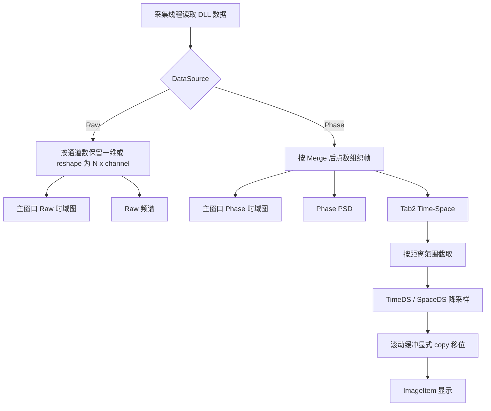

# 2026-6-16 PCIe-6921 上位机开发问题解决日志

## 1. 背景

本次修改针对现场使用中暴露的四类问题：Raw 时域图通道选择、Raw 频谱采样率、Phase 模式 PSD 绘制，以及 Tab2 Time-Space 放大后出现异常色块。修改范围集中在参数校验、主窗口显示编排、频谱采样率换算、Time-Space 滚动缓冲和自动化测试。

## 2. 问题与结论

### 2.1 Raw 时域图为什么必须选择 2 通道，能否选择 1 通道

旧版本在 `main_window.py` 中切换到 Raw 时自动把 `Channels` 设置为 `2` 并禁用下拉框，启动校验也拒绝 Raw 单通道。这是早期迁移时把 Raw 上传理解为固定双 ADC 的保守处理。

本次修正后 Raw 模式允许选择 `1` 或 `2` 通道：

- Raw 单通道：`point_num <= 131072`，且 `point_num` 必须为 `256` 的整数倍。
- Raw 双通道：`point_num <= 65536`，且 `point_num` 必须为 `128` 的整数倍。
- 采集线程仍按 DLL 返回数据布局处理：单通道保持一维数组，双通道按交织数据 reshape 为 `N x 2`。

因此 Raw 时域图现在可以选择 `1` 通道。

### 2.2 Raw 模式下 PSD/频谱使用的采样率是否为 1 GHz

旧版本 Raw 频谱使用：

$$
f_s = \frac{1\ \mathrm{GHz}}{upload\_rate\_code}
$$

这会让 `upload_rate_code = 1` 时频率轴显示为 `1 GHz` 采样率。根据当前 PCIe-6921 采集卡参数，应按 `250 MHz` 基准理解上传采样率，映射为：

$$
f_s(upload\_rate) \in \{250, 125, 83.33, 62.5, 50\}\ \mathrm{MHz}
$$

代码中新增 `get_upload_sample_rate_hz()`，Raw 频谱统一使用该映射。因此 `upload_rate_code = 1` 时 Raw 频谱采样率为 `250 MHz`，Nyquist 频率为 `125 MHz`。

### 2.3 Phase 模式勾选 PSD 但无法绘制 PSD 的原因

当前界面中的 `Spectrum` 开关控制频谱绘制，`PSD/Power` 标签由数据类型自动决定：

- Raw 数据显示 Power Spectrum。
- Phase 数据显示 PSD。

旧版本单通道 Phase 在 Time/Space 模式下能够进入 `_update_spectrum()`，但双通道 Phase 路径只更新了时域曲线，没有调用 `_update_spectrum()`，因此表现为勾选 `Spectrum` 后仍无 PSD 曲线。

本次修正后：

- Phase 单通道 Time 模式继续使用最新一帧计算 PSD。
- Phase 单通道 Space 模式继续使用指定空间点的时间序列计算 PSD。
- Phase 双通道 Time 模式使用第 1 通道最新一帧计算 PSD。
- Phase 双通道 Space 模式使用第 1 通道指定空间点的时间序列计算 PSD。

Phase PSD 的时间采样率仍为扫描重复频率：

$$
f_s = scan\_rate
$$

### 2.4 Tab2 Space-Time 放大后的蓝色或红色方格

排查结论分为两部分。

第一，放大后看到规则像素方格本身是正常现象。Time-Space 图是二维栅格图像，默认参数存在降采样：

$$
TimeDS = 50, \quad SpaceDS = 2
$$

因此放大到像素级时，每个采样格会以矩形块显示。

第二，旧版本滚动窗口使用了重叠切片赋值：

```python
buffer[:, :-block_width] = buffer[:, block_width:]
```

NumPy 对重叠内存区域赋值虽然通常可工作，但这里是长期滚动显示缓冲，现场排查应避免依赖隐式行为。本次修改为显式拷贝后再移位：

```python
shifted = buffer[:, block_width:].copy()
buffer[:, :-block_width] = shifted
buffer[:, -block_width:] = display_block
```

这可以排除滚动拼接时历史列被覆盖污染的风险。若修复后仍出现大量红/蓝块，优先检查以下显示参数而不是数组拼接：

- `Color Range` 是否过窄，例如 Phase rad 显示默认 `[-0.02, 0.02]`，超出范围会被饱和为红色或蓝色。
- `Time DS` 和 `Space DS` 是否过大；放大排查时建议临时设为 `1`。
- 输入信号是否存在真实尖峰或突变。

## 3. 修改文件

- `src/config.py`：新增上传速率到实际采样率映射；修正 Raw 单/双通道点数约束。
- `src/main_window.py`：取消 Raw 强制双通道；Raw 频谱采样率改为真实上传采样率；补齐 Phase 双通道 PSD 绘制路径。
- `src/time_space_plot.py`：滚动缓冲移位使用显式 `.copy()`，避免重叠切片赋值风险。
- `tests/test_config.py`：增加 Raw 单/双通道校验与上传采样率映射测试。
- `README.md`：同步更新 Raw 通道和 Raw 频谱采样率说明。

## 4. 数据流说明



## 5. 验证

已执行：

```powershell
python -m unittest discover -s tests -v
python -m py_compile src\config.py src\main_window.py src\time_space_plot.py src\spectrum_analyzer.py tests\test_config.py
```

验证结果：

- 单元测试 `9` 项全部通过。
- 关键源码和测试文件 Python 编译通过。
- Markdown 文档使用 `encoding='utf-8'` 写入，并执行中文自检，未发现问号乱码占位符。

## 6. 后续现场建议

1. Raw 单通道带卡测试建议先使用 `upload_rate = 1`、`point_num = 20480`、`frame_load_num = 1024`。
2. Raw 频谱检查时确认频率轴最大值约为 `125 MHz`，对应 `250 MHz` 采样率的 Nyquist 频率。
3. Phase PSD 检查时先使用单通道，再验证双通道第 1 通道 PSD 是否随信号变化。
4. Time-Space 放大排查时临时设置 `Time DS = 1`、`Space DS = 1`，并适当放宽 `Color Range`，用于区分显示色阶饱和与真实数据突变。
