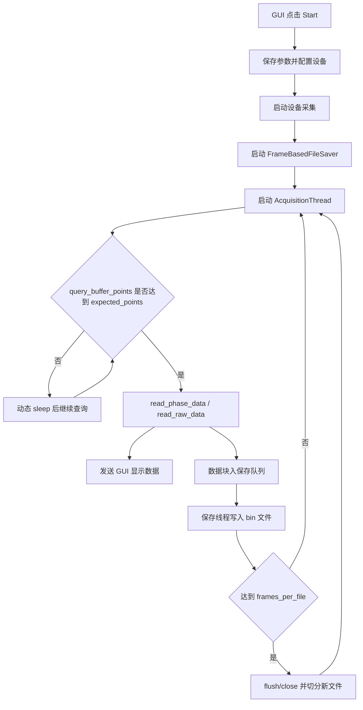

# 2026-6-17 运行一晚上测试日志分析报告与问题修复方案

## 1. 分析范围

- 日志文件：`logs/20260617_005055.log`
- 日志总行数：30,907 行
- 本报告重点分析本地硬盘存满之前的日志，即第 1 行至第 18,719 行。
- 首次硬盘存满日志出现在第 18,720 行：`DataSaver error: [Errno 28] No space left on device`。
- 第 18,720 行之后的错误属于本地磁盘空间耗尽造成的连带噪声，按测试说明不作为软件主要缺陷判定依据。

本次日志包含两段采集：

| 阶段 | 起止日志 | 参数 | 结果 |
| --- | --- | --- | --- |
| 第一段短采集 | 第 24 行开始，第 253 行停止 | `scan_rate=3000`，`points=52500`，`channels=1`，`data_source=4`，`frame_load=3000` | 手动停止，采集 260 个数据回调，无丢弃 |
| 第二段长采集 | 第 254 行开始，第 18,719 行为磁盘满前最后有效记录 | `scan_rate=4000`，`points=52500`，`channels=1`，`data_source=4`，`frame_load=4000` | 磁盘满前持续运行约 6.65 小时，无业务错误、无保存队列堆积、无 GUI skip |

硬盘存满前的核心运行指标如下：

| 指标 | 数值 | 说明 |
| --- | ---: | --- |
| `[ERROR]` 数量 | 0 | 不含硬盘满之后的错误 |
| `[WARNING]` 数量 | 366 | 主要为慢写盘和慢查询 |
| 慢写盘 warning | 287 | `Slow disk write`，最大 441.4 ms，平均 185.6 ms |
| API 慢查询 warning | 42 | `query_buffer_points took ...`，最大 262.4 ms，平均 170.0 ms |
| 采集线程慢查询 warning | 37 | `Slow query_buffer_points ...`，与 API 慢查询存在重复口径 |
| 保存队列峰值 | 1/200 | 未出现保存队列堆积 |
| 保存丢弃 | 0 | `save_dropped=0` |
| GUI skip | 0 | `gui_skips=0` |
| 读数据耗时 | 平均 40.35 ms，最大 304.6 ms | 绝大多数稳定，存在单次尖峰 |
| 文件切分次数 | 4,782 | 磁盘满前持续按帧切分文件 |

第二段采集在磁盘满前最后有效状态约为 `frames=94584000`，单块大小为 33,600,000 B。保存统计满足：

$$
	ext{saved\_bytes}=23646 	imes 33{,}600{,}000=794{,}505{,}600{,}000\ 	ext{B}
$$

## 2. 总体结论

硬盘存满之前，软件主采集链路总体稳定。日志中没有发现采集 API 返回错误、线程异常、超时、缓冲区溢出、保存队列满、丢帧、GUI 更新跳过等直接数据丢失证据。

需要修复或优化的问题主要集中在四类：

1. 写盘耗时存在明显抖动，虽然当前测试没有造成队列堆积，但在更高采样率、双通道、较慢硬盘或系统负载更高时有实时性风险。
2. `query_buffer_points()` 偶发阻塞超过 200 ms，并且 API 层与采集线程层重复记录同一慢查询事件，影响日志判读。
3. 读数据耗时存在单次 304.6 ms 尖峰，但当前没有专门的慢读 warning 和分位数统计，现场定位能力不足。
4. 停止保存时的日志口径存在误导风险：父类日志打印 `Bytes written: 0` 容易被误解为未保存数据；总统计日志在当前输出中重复出现两次。

## 3. 问题清单、原因、严重程度与方案

### P1：写盘耗时抖动较大

**现象**

硬盘存满前共有 287 条慢写盘 warning：

- 最大写盘耗时：441.4 ms，第 299 行。
- 平均慢写盘耗时：185.6 ms。
- 每块写入大小：第二段为 33,600,000 B，即约 32.04 MiB。
- 保存队列峰值仅为 1/200，未出现队列堆积和丢弃。

典型日志：

```text
[  313607.6 ms] [Thread-4] [WARNING] pcie6921.data_saver : Slow disk write: 441.4ms, bytes=33600000, queue=0/200
```

**原因分析**

当前保存链路是异步生产者-消费者模型，采集线程只入队，后台保存线程执行 `numpy` 数据转字节和文件写入。单块大小约 32.04 MiB，慢写盘耗时可由以下因素叠加产生：

- `data.tobytes()` 会产生一次完整内存拷贝，32 MiB 数据块会带来 CPU 和内存带宽开销。
- 文件按帧切分，第二段大约每 5 秒切一个文件，切分时需要 `flush()`、`close()`、打开新文件，存在文件系统元数据开销。
- Windows 本地磁盘写缓存、杀毒软件扫描、文件系统碎片、目标盘剩余空间降低等都会造成写入尖峰。
- 当前 warning 阈值为 50 ms。对 32 MiB 级别写入来说，50 ms 等价于约 640 MiB/s 的吞吐要求；普通机械盘或忙碌 SSD 达不到该阈值并不一定代表失败。

写入吞吐可按下式估算：

$$
	ext{throughput}=rac{	ext{block\_bytes}}{	ext{write\_ms}/1000}
$$

最大慢写 441.4 ms 对应吞吐约：

$$
rac{33{,}600{,}000}{0.4414}pprox76.1\ 	ext{MB/s}
$$

平均慢写 185.6 ms 对应吞吐约：

$$
rac{33{,}600{,}000}{0.1856}pprox181.0\ 	ext{MB/s}
$$

**严重程度：中**

本次硬盘满之前没有造成丢数据，严重程度不是高。但该问题影响系统余量：一旦采样率、通道数、磁盘负载上升，保存线程可能从 `queue=1/200` 发展到队列堆积，最终导致丢弃。

**解决方案**

- 将写盘 warning 阈值从固定 50 ms 改为与块大小相关的吞吐阈值，例如低于 150 MiB/s 或连续 N 次慢写再报警。
- 增加写盘分位数统计：`p50/p95/p99/max`，避免只靠零散 warning 判断稳定性。
- 优化写入路径，优先评估使用 `memoryview(data)` 或 `data.tofile()` 减少 `tobytes()` 大块拷贝成本。
- 文件切分策略增加可配置项，例如每文件 5 秒改为 30 秒或按容量切分，降低频繁 `flush/close/open` 的文件系统开销。
- 启动采集前增加目标盘空间与粗略吞吐预检，按预计数据率给出最少可运行时长。

### P2：`query_buffer_points()` 偶发阻塞

**现象**

硬盘存满前 API 层记录 42 次慢查询，采集线程层记录 37 次慢查询。两类日志大多描述同一次事件。

- API 层最大耗时：262.4 ms。
- API 层平均慢查询耗时：170.0 ms。
- 采集线程层最大耗时：264.4 ms。

典型日志：

```text
[22205932.9 ms] [Dummy-5] [WARNING] pcie6921.api : query_buffer_points took 262.4 ms, points=1579256
```

**原因分析**

`query_buffer_points()` 是采集线程等待数据时的高频查询接口，偶发阻塞可能来自：

- DLL 或驱动内部锁等待，尤其是查询缓冲区与读取 DMA 数据同时发生时。
- PCIe 设备或驱动在特定时间片返回缓冲状态较慢。
- Windows 线程调度、DPC/ISR、磁盘或 GUI 负载造成采集线程短时间得不到 CPU。
- API 层与采集线程层分别记录同一慢调用，导致 warning 数量看起来比实际慢事件更多。

**严重程度：中低**

本次没有触发等待超时，也没有导致采集线程停止。`waits` 最大 55，保存队列和 GUI skip 均正常。因此当前是实时性抖动和日志可读性问题，不是直接数据错误。

**解决方案**

- 合并慢查询日志口径：API 层负责记录实际 DLL 调用耗时，采集线程只记录连续慢查询或等待总耗时异常。
- 增加连续慢查询计数，例如连续 3 次超过 100 ms 才升为 warning，单次尖峰降为 debug 或 info 统计。
- 在诊断快照中增加 `query_p95_ms/query_p99_ms/query_slow_count`。
- 如果慢查询在后续测试中随采样率上升而增加，应单独做 DLL/驱动层压测，并向板卡 API 供应方确认 `query_buffer_points()` 是否可能阻塞以及是否有非阻塞替代接口。

### P3：读数据耗时存在尖峰但缺少专门告警

**现象**

硬盘存满前，读数据耗时平均 40.35 ms，但存在一次明显尖峰：

```text
[  741201.2 ms] [MainThread] [INFO] pcie6921.gui : Acq snapshot: ... read_ms=304.6 ... block_mb=32.04 ... save_queue=0/200 ... save_dropped=0
```

除该尖峰外，其余较高读耗时主要在 50 ms 至 85 ms 区间。

**原因分析**

该尖峰没有伴随错误、丢弃、队列堆积或 GUI skip。可能原因包括：

- DLL 读数据调用偶发阻塞。
- Python 线程调度或 GIL 竞争造成采集线程执行时间拉长。
- 大块数据从 DLL 缓冲区复制到 `numpy` 数组时出现内存带宽抖动。
- 与文件写盘、系统缓存刷新或其他系统任务短时间竞争资源。

当前日志只在周期性快照里被动暴露 `read_ms=304.6`，没有独立 warning；如果快照没有刚好覆盖，尖峰可能被漏掉。

**严重程度：中低**

单次尖峰未造成数据损失，但会压缩 1 秒采集周期的安全余量。按当前 1 秒数据块计算，304.6 ms 仍低于块周期，但如果后续块周期缩短或通道数增加，需要提高关注。

**解决方案**

- 为读数据调用增加慢读阈值，例如 `read_ms > min(200 ms, block_duration_ms * 0.25)` 时记录 warning。
- 采集线程维护 `read_p95_ms/read_p99_ms/read_max_ms/read_slow_count`。
- 慢读日志中补充 `expected_points`、`actual_buffer_points`、`block_bytes`、`data_source`、`channels`，便于区分 DLL、内存复制和参数规模问题。

### P4：保存统计日志口径误导

**现象**

停止保存时出现如下日志：

```text
Stopped saving. Bytes written: 0, Blocks: 260, Dropped: 0, Max queue: 1/200, Last write: 19.6ms/25200000B
Total files created: 53, Total frames saved: 260, Total bytes: 6552000000
Total files created: 53, Total frames saved: 260, Total bytes: 6552000000
```

第二段停止时同样出现：

```text
Stopped saving. Bytes written: 0, Blocks: 23650, Dropped: 0, Max queue: 1/200, Last write: 167.3ms/33600000B
Total files created: 6105, Total frames saved: 30521, Total bytes: 794640000000
Total files created: 6105, Total frames saved: 30521, Total bytes: 794640000000
```

**原因分析**

`FrameBasedFileSaver` 切分文件时会把当前文件字节数累加到 `_total_bytes_all_files`，然后把 `_bytes_written` 重置为 0。父类 `DataSaver.stop()` 打印的 `Bytes written` 实际是当前活动文件字节数，不是本轮总保存字节数。

因此，`Bytes written: 0` 不代表没有保存数据，但这个表述容易误导现场判断。总统计重复输出两次，可能来自停止流程中显式调用和析构/重复 stop 路径叠加，需要进一步确认调用链。

**严重程度：中**

该问题不影响采集数据本身，但会显著影响现场排障。尤其在长时间测试后看到 `Bytes written: 0`，容易误判为保存失败。

**解决方案**

- 父类停止日志改名为 `Current file bytes`，或由子类覆盖停止日志，统一输出总量。
- `FrameBasedFileSaver.stop()` 中先计算并缓存 `total_bytes_all_files`，再只输出一次总统计。
- 增加 `_stopped_logged` 或保证 `stop()` 幂等，避免析构或重复 stop 造成重复统计日志。
- 诊断快照中同时暴露 `current_file_bytes` 和 `total_bytes_all_files`。

### P5：磁盘容量预警缺失

**现象**

虽然本报告不把硬盘满作为软件缺陷主因，但日志显示在硬盘真正写满前，软件没有提前给出容量不足预警。首次硬盘满发生后，保存线程继续周期性报错，采集线程仍继续运行。

**原因分析**

保存模块目前更关注队列和写入耗时，没有在采集开始前或运行中持续估算剩余可写时间。

可按数据率估算剩余运行时间：

$$
	ext{remaining\_seconds}=rac{	ext{free\_bytes}}{	ext{bytes\_per\_second}}
$$

第二段参数下，每秒保存约 33,600,000 B，约 32.04 MiB/s。若只剩 100 GiB，则理论剩余时间约：

$$
rac{100 	imes 1024^3}{33{,}600{,}000}pprox3196\ 	ext{s}pprox53.3\ 	ext{min}
$$

**严重程度：中**

外部磁盘满不是程序 bug，但缺少预警会导致长时间无人值守测试后数据保存中断，属于工程可靠性问题。

**解决方案**

- 启动前检查保存目录所在磁盘剩余空间，按当前参数估算可运行时长。
- 运行中每 30 秒至 60 秒检查一次剩余空间。
- 剩余空间低于阈值时在 GUI 明确告警，并写入 warning。
- 进入极低空间阈值时提供策略选择：停止采集、停止保存但继续显示、或继续尝试保存。

## 4. 建议修复优先级

| 优先级 | 项目 | 目标 |
| --- | --- | --- |
| P0 | 不需要针对硬盘满本身修业务代码 | 本次已明确为本地环境问题，但应保留容量预警改进 |
| P1 | 修正保存统计日志口径和重复输出 | 避免现场误判 `Bytes written: 0` |
| P1 | 增加磁盘剩余空间预检和运行中预警 | 降低无人值守测试数据中断风险 |
| P2 | 优化慢写盘告警策略和统计 | 从固定阈值改为吞吐/连续次数/分位数口径 |
| P2 | 合并慢查询重复日志并增加分位数 | 减少日志噪声，保留诊断价值 |
| P3 | 增加慢读 warning 和读耗时统计 | 捕捉偶发 300 ms 级尖峰 |

## 5. 建议验证方案

1. 使用相同参数复测 30 分钟，确认硬盘未满时 `[ERROR]=0`、`save_dropped=0`、`gui_skips=0`。
2. 记录写盘 `p50/p95/p99/max`，判断慢写是否集中在文件切分附近。
3. 对比修改前后 warning 数量，确认重复慢查询日志被归并。
4. 人为设置低剩余空间测试目录，验证启动前预警和运行中预警是否准确。
5. 使用更高负载参数测试保存队列余量，观察 `save_queue` 是否长期大于 0。

## 6. 采集与保存链路流程图



## 7. 本次不改代码时的结论

硬盘存满之前，软件没有表现出采集崩溃、API 错误、保存队列溢出或 GUI 阻塞。当前最需要修复的是工程可观测性和长期运行可靠性：保存统计日志应准确，磁盘容量应提前预警，慢写/慢查/慢读应使用更合理的统计口径。完成这些修复后，再进行一轮夜间测试，才能判断是否需要进一步深入 DLL 或驱动层问题。
