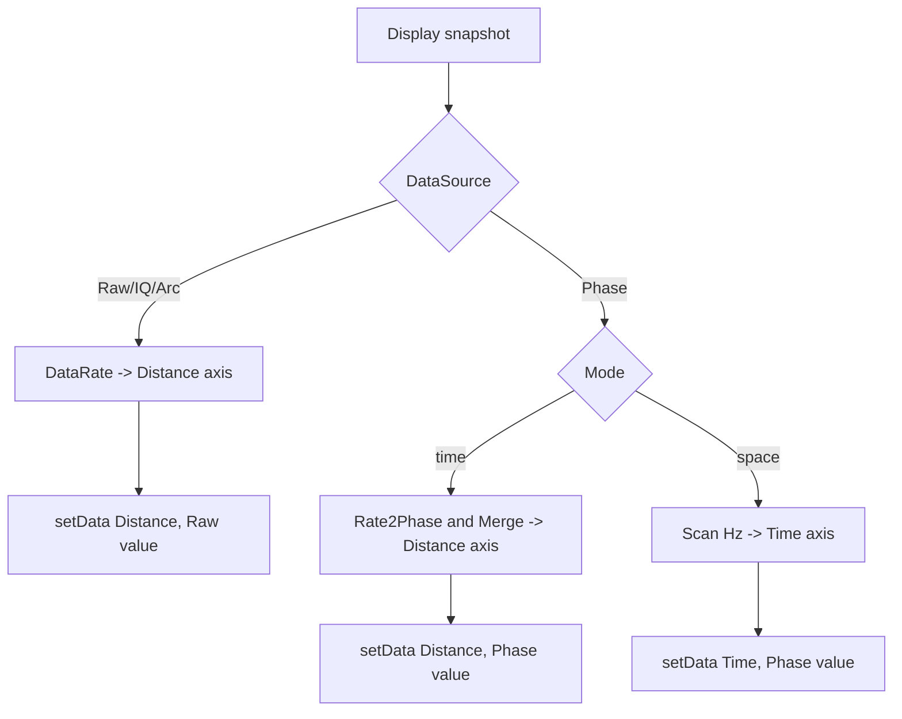

# 2026-6-17 Tab1 时域图坐标轴修改日志

## 1. 修改背景

Tab1 的 `Time Domain Data` 图原先使用隐式样本序号作为横轴，不能直接反映 Raw、Phase-Time 和 Phase-Space 场景下的物理含义。本次修改将 Tab1 时域曲线改为显式传入横轴数组。

本次修改仅影响 Tab1 时域图的横轴数据和横轴标签，不改变采集、保存、相位转弧度、频谱分析和 Tab2 Time-Space 图的数据链路。

## 2. 坐标轴规则

### 2.1 Raw 模式

Raw 模式下，横轴代表距离，标签为 `Distance (m)`。点间距由 `Upload Parameters` 中的 `DataRate` 决定。

| DataRate | 点间距 |
| --- | --- |
| `250M` | `$0.4\ m$` |
| `125M` | `$0.8\ m$` |
| `83.33M` | `$1.2\ m$` |
| `62.5M` | `$1.6\ m$` |
| `50M` | `$2.0\ m$` |

当 `Points = N`、Raw 点间距为 `$\Delta x_{raw}$` 时，横轴数组为：

$$
x_{raw}=[1,2,3,\ldots,N]\times\Delta x_{raw}
$$

例如 `DataRate = 250M` 时：

$$
x_{raw}=[1,2,3,\ldots,N]\times0.4\ m
$$

### 2.2 Phase 模式，Mode=time

Phase 模式且绘图参数 `Mode=time` 时，横轴代表距离，标签为 `Distance (m)`。点间距由 `Rate2Phase` 和 `Merge` 共同决定。

当 `Points = N`、`Merge = M`、基础点间距为 `$\Delta x_{rate}$` 时：

$$
N_{phase}=\frac{N}{M}
$$

$$
\Delta x_{phase}=\Delta x_{rate}\times M
$$

$$
x_{phase}=[1,2,3,\ldots,N_{phase}]\times\Delta x_{phase}
$$

例如 `Rate2Phase = 250M`、`Merge = 20` 时：

$$
\Delta x_{phase}=0.4\ m\times20=8\ m
$$

$$
x_{phase}=[1,2,3,\ldots,N/20]\times8\ m
$$

### 2.3 Phase 模式，Mode=space

Phase 模式且绘图参数 `Mode=space` 时，横轴代表时间，标签为 `Time (s)`。点间距由 `Scan(Hz)` 决定。

当 `Scan = f_s`、`FramePlot = F` 时：

$$
\Delta t=\frac{1}{f_s}
$$

$$
t=[1,2,3,\ldots,F]\times\frac{1}{f_s}
$$

例如 `Scan = 2000 Hz` 时：

$$
\Delta t=\frac{1}{2000}\ s=0.0005\ s
$$

## 3. 实现内容

修改文件：`src/main_window.py`。

新增辅助函数：

- `_meters_per_point_for_rate(rate_code)`：按 `DataRate/Rate2Phase` 编码返回基础距离间隔。
- `_raw_distance_axis(point_count)`：生成 Raw 模式的一基距离轴。
- `_phase_distance_axis(point_count)`：生成 Phase-Time 模式的一基距离轴，并乘以 `Merge`。
- `_phase_time_axis(frame_count)`：生成 Phase-Space 模式的一基时间轴。
- `_set_tab1_waveform_x_label(text)`：统一更新 Tab1 时域图横轴标签样式。

绘图路径调整：

- Raw 显示路径由 `setData(y)` 改为 `setData(x_raw, y)`。
- Phase-Time 显示路径由 `setData(y)` 改为 `setData(x_phase, y)`。
- Phase-Space 显示路径由 `setData(y)` 改为 `setData(t, y)`。

## 4. 流程图



## 5. 验证记录

已执行 Python 编译检查：

```powershell
python -m py_compile src\main_window.py
```

已执行 UTF-8 与中文自检，检查 `src/main_window.py`、`docs/dev_log.md` 和本文档，确认未发现 Unicode replacement character 或中文乱码问号占位。

## 6. 影响范围

- 不改变原始数据保存内容。
- 不改变频谱图采样率计算逻辑。
- 不改变 Tab2 Time-Space 图坐标轴。
- Phase 单通道启用空间裁剪时，Tab1 按裁剪后的显示点数生成横轴，横轴从第一个显示点按一基坐标重新计数。
