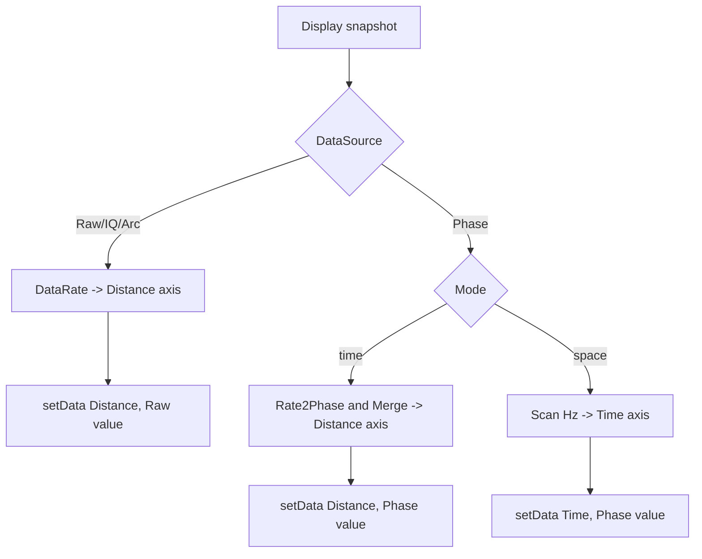
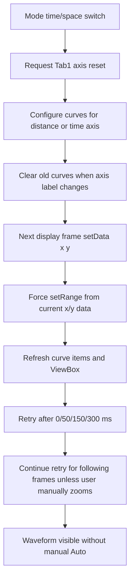

# 2026-6-17 Tab1 时域图坐标轴修改日志

## 1. 修改背景

Tab1 的 `Time Domain Data` 图原先使用隐式样本序号作为横轴，不能直接反映 Raw、Phase-Time 和 Phase-Space 场景下的物理含义。本次修改将 Tab1 时域曲线改为显式传入横轴数组。

本次修改仅影响 Tab1 时域图的横轴数据和横轴标签，不改变采集、保存、相位转弧度、频谱分析和 Tab2 Time-Space 图的数据链路。

## 2. 坐标轴规则

### 2.1 Raw 模式

Raw 模式下，横轴代表距离，标签为 `Distance (m)`。点间距由 `Upload Parameters` 中的 `DataRate` 决定。

| DataRate | 点间距 |
| --- | --- |
| `250M` | `$0.4\ m$` |
| `125M` | `$0.8\ m$` |
| `83.33M` | `$1.2\ m$` |
| `62.5M` | `$1.6\ m$` |
| `50M` | `$2.0\ m$` |

当 `Points = N`、Raw 点间距为 `$\Delta x_{raw}$` 时，横轴数组为：

$$
x_{raw}=[1,2,3,\ldots,N]\times\Delta x_{raw}
$$

例如 `DataRate = 250M` 时：

$$
x_{raw}=[1,2,3,\ldots,N]\times0.4\ m
$$

### 2.2 Phase 模式，Mode=time

Phase 模式且绘图参数 `Mode=time` 时，横轴代表距离，标签为 `Distance (m)`。点间距由 `Rate2Phase` 和 `Merge` 共同决定。

当 `Points = N`、`Merge = M`、基础点间距为 `$\Delta x_{rate}$` 时：

$$
N_{phase}=\frac{N}{M}
$$

$$
\Delta x_{phase}=\Delta x_{rate}\times M
$$

$$
x_{phase}=[1,2,3,\ldots,N_{phase}]\times\Delta x_{phase}
$$

例如 `Rate2Phase = 250M`、`Merge = 20` 时：

$$
\Delta x_{phase}=0.4\ m\times20=8\ m
$$

$$
x_{phase}=[1,2,3,\ldots,N/20]\times8\ m
$$

### 2.3 Phase 模式，Mode=space

Phase 模式且绘图参数 `Mode=space` 时，横轴代表时间，标签为 `Time (s)`。点间距由 `Scan(Hz)` 决定。

当 `Scan = f_s`、`FramePlot = F` 时：

$$
\Delta t=\frac{1}{f_s}
$$

$$
t=[1,2,3,\ldots,F]\times\frac{1}{f_s}
$$

例如 `Scan = 2000 Hz` 时：

$$
\Delta t=\frac{1}{2000}\ s=0.0005\ s
$$

## 3. 实现内容

修改文件：`src/main_window.py`。

新增辅助函数：

- `_meters_per_point_for_rate(rate_code)`：按 `DataRate/Rate2Phase` 编码返回基础距离间隔。
- `_raw_distance_axis(point_count)`：生成 Raw 模式的一基距离轴。
- `_phase_distance_axis(point_count)`：生成 Phase-Time 模式的一基距离轴，并乘以 `Merge`。
- `_phase_time_axis(frame_count)`：生成 Phase-Space 模式的一基时间轴。
- `_set_tab1_waveform_x_label(text)`：统一更新 Tab1 时域图横轴标签样式。

绘图路径调整：

- Raw 显示路径由 `setData(y)` 改为 `setData(x_raw, y)`。
- Phase-Time 显示路径由 `setData(y)` 改为 `setData(x_phase, y)`。
- Phase-Space 显示路径由 `setData(y)` 改为 `setData(t, y)`。

## 4. 流程图



## 5. 验证记录

已执行 Python 编译检查：

```powershell
python -m py_compile src\main_window.py
```

已执行 UTF-8 与中文自检，检查 `src/main_window.py`、`docs/dev_log.md` 和本文档，确认未发现 Unicode replacement character 或中文乱码问号占位。

## 6. 影响范围

- 不改变原始数据保存内容。
- 不改变频谱图采样率计算逻辑。
- 不改变 Tab2 Time-Space 图坐标轴。
- Phase 单通道启用空间裁剪时，Tab1 按裁剪后的显示点数生成横轴，横轴从第一个显示点按一基坐标重新计数。


## 7. 2026-06-17 补充：Phase Mode=space 时域波形可见性修复

### 7.1 问题分析

Phase 模式下，`Mode=space` 应显示指定 `Region` 随时间变化的时域波形。本次复核后确认，确实存在两类“看起来没有波形”的风险。

第一类是 Plot1 交互缩放状态残留。用户在 `Distance (m)` 横轴下框选、滚轮缩放或平移后，`_plot_zoom_locked["plot1"]` 会变为 `True`，ViewBox 会保留手动 X 范围。当横轴从米级距离切换为秒级时间时，新曲线可能落在可视范围外。

$$
Distance: 0\sim8000\ m
$$

$$
Time: 0.0005\sim0.512\ s
$$

第二类是单通道 Phase 启用 `CropStart/CropEnd` 后，采集线程发布最新显示快照时仍使用裁剪前的 `Points/Merge` 作为每帧点数。当裁剪后数据长度小于裁剪前点数时，GUI 会判定 `frame_num <= 0` 并直接返回。

### 7.2 修复内容

`src/main_window.py` 修复：

- 增加 `_tab1_waveform_x_label` 记录 Plot1 当前横轴语义。
- 增加 `_tab1_axis_reset_pending` 延迟恢复全视图标记。
- 当 Plot1 横轴在 `Distance (m)` 与 `Time (s)` 之间切换时，自动清除 `_plot_zoom_locked["plot1"]`，重新启用 X/Y 自动范围。
- 新曲线数据写入后，通过 `QTimer.singleShot(0, ...)` 执行一次 `View All` 等效恢复。

`src/acquisition_thread.py` 修复：

- 增加 `_display_points_per_frame(data_source, channel_num)`。
- Raw 显示快照仍使用 `Points` 作为每帧点数。
- Phase 双通道仍使用 `Points/Merge`。
- Phase 单通道使用裁剪后宽度：

$$
N_{display}=CropEnd-CropStart
$$

其中 `CropEnd=0` 或边界超限时，仍由 `resolve_phase_crop_bounds()` 统一解析。

### 7.3 修复后行为

修复后，Phase `Mode=space` 在以下场景不再因视图范围或裁剪点数错误而看起来没有波形：

- 从 Raw 或 Phase `Mode=time` 的 `Distance (m)` 横轴切换到 Phase `Mode=space` 的 `Time (s)` 横轴。
- 用户此前对 Plot1 做过框选、滚轮缩放或平移。
- 单通道 Phase 启用了 `CropStart/CropEnd` 空间裁剪。

注意：`Waveform` 仍是 Plot1 波形绘制的显式开关。如果 `Waveform` 未勾选，不绘制 Plot1 波形是预期行为。

### 7.4 补充验证

新增单元测试：`tests/test_acquisition_display.py`。

验证项包括：

- 单通道 Phase 启用空间裁剪时，显示快照每帧点数使用裁剪后宽度。
- 双通道 Phase 不应用单通道裁剪宽度，仍使用 `Points/Merge`。
- `src/main_window.py` 和 `src/acquisition_thread.py` 通过 Python 编译检查。
- 全量 `unittest discover` 通过。
- UTF-8 中文自检通过，未发现 Unicode replacement character 或中文乱码问号占位。


## 8. 2026-06-17 补充：Mode 切换后显式视图范围恢复优化

### 8.1 问题复核

进一步复核后确认，仅依赖 `ViewBox.autoRange()` 仍不够稳定。Plot1 曲线启用了 `ClipToView` 和自动降采样，当旧视图范围完全不包含新的秒级 X 数据时，自动范围推断可能拿不到有效的曲线边界。这会造成以下现象：

- Phase `Mode=time` 切换到 `Mode=space` 后，需要先框选改变视图，再点击 `Auto/View All` 才显示波形。
- Phase `Mode=space` 切换回 `Mode=time` 后，仍需要点击 `Auto/View All` 才能看到波形。

问题本质不是数据未到达，而是 Plot1 视图范围没有跟随横轴物理量级的变化而重置。

### 8.2 优化内容

`src/main_window.py` 进一步优化：

- 新增 `_request_tab1_axis_reset()`，统一标记 Plot1 需要在下一帧波形写入后重置范围。
- `Mode=time` 与 `Mode=space` 互相切换时，立即触发 `_request_tab1_axis_reset()`。
- `Waveform` 从关闭切到打开时，也触发一次范围重置请求。
- `_flush_tab1_axis_reset(x_values, y_values)` 不再只调用 `autoRange()`，而是使用本次刚写入 Plot1 的 X/Y 数据显式计算范围并调用 `setRange()`。

范围计算逻辑：

$$
X_{view}=[\min(X),\max(X)]
$$

$$
Y_{view}=[\min(Y),\max(Y)]
$$

当上下限相等时，自动扩展一个小范围，避免单点或常值波形无法建立可见范围。

### 8.3 效果

优化后，Phase 模式下 `Mode=time` 与 `Mode=space` 互相切换时，不再需要先框选放大或手动点击 `Auto/View All` 才能看到波形。下一帧有效显示数据到达后，Plot1 会按新坐标系自动恢复到可见范围。


## 9. 2026-06-18 对照 PCIe-7821 日志后的补充检查与修复

### 9.1 对照结论

参照 `E:/codes/PCIe-7821/pcie7821_gui/docs/2026-6-17-tab1时域图坐标轴修改日志.md` 复核后确认，PCIe-7821 项目后续记录了更完整的 Tab1 视图恢复策略：

- 在新曲线 `setData(x,y)` 之后再执行自动范围恢复。
- 不只依赖 `ViewBox.autoRange()`，而是从 `curve.getData()` 读取真实 X/Y 边界并显式 `setRange()`。
- 通过 `QTimer.singleShot(0/50/150/300 ms)` 延迟重试，覆盖 Qt 事件循环和 pyqtgraph 边界缓存更新的异步窗口。
- 在切到秒级 `Time (s)` 轴时，临时关闭 Plot1 曲线的 `clipToView` 和自动降采样，避免旧米级视图裁剪出空路径。
- 在强制设置视图范围后主动刷新 PlotDataItem、PlotItem 和 ViewBox。

本项目在 2026-06-17 已经完成基础坐标轴修改和一次显式 `setRange()` 修复，但尚未包含上述全部兜底机制。因此存在与 7821 后续现场问题类似的残留风险。

### 9.2 本次修复

本次在 `src/main_window.py` 中补齐以下机制：

- 新增 `_tab1_axis_reset_frames_remaining`，在横轴语义切换后连续若干帧尝试恢复范围。
- 新增 `_tab1_axis_reset_generation`，保证延迟恢复任务不会覆盖更新的 Mode 切换状态。
- 新增 `_configure_tab1_curves_for_axis()`，切到 `Time (s)` 轴时关闭 `clipToView` 和自动降采样，切回 `Distance (m)` 轴时恢复实时大曲线优化。
- 新增 `_tab1_curve_data_range()` 和 `_force_tab1_range_to_curve_data()`，直接使用本帧数据或当前曲线 `getData()` 结果计算真实边界。
- 新增 `_schedule_tab1_axis_reset_retries()` 和 `_retry_tab1_axis_reset()`，在 `0/50/150/300 ms` 延迟重试恢复范围。
- 新增 `_refresh_tab1_curve_items()`，在强制 `setRange()` 后刷新 Plot1 曲线项和 ViewBox。
- `_set_tab1_waveform_x_label()` 在横轴标签变化时清空旧曲线，避免不同物理单位的旧数据残留。

### 9.3 修复后流程



本次修复不改变 Raw、Phase-Time、Phase-Space 的坐标公式，也不改变采集线程、保存线程、Spectrum、Monitor 或 Tab2 Time-Space 逻辑。影响范围仅限于 Tab1 时域图在横轴物理量切换后的视图恢复和曲线刷新确定性。
