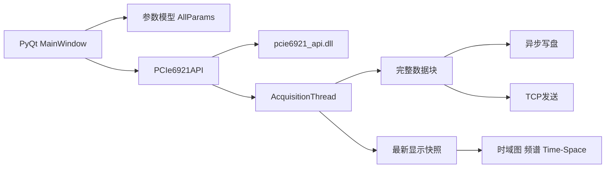

# PCIe6921上位机开发方案

## 1. 目标与范围

本方案面向 `PCIe-6921` 采集卡上位机开发，目标是在 `PCIe-6921` 项目的基础上，保持以下方面尽量一致：

- 软件功能范围一致
- GUI 布局与交互方式一致
- 采集线程、显示线程、保存线程、TCP 线程的数据流组织一致
- 配置持久化、日志、异常恢复、实时显示策略一致

本阶段只输出开发方案，不直接进入编码。

## 2. 设计原则

### 2.1 架构复用优先

优先复用 `7821` 已验证的上层结构，不重新设计主窗口、线程模型和显示链路。`6921` 的差异应尽可能被压缩在设备适配层和参数映射层。

### 2.2 设备差异前置隔离

所有 `6921` 特有差异都不应散落在 GUI 控件回调中，而应集中到：

- `config` 设备参数定义
- `api` 封装层
- 参数合法性校验器
- 设备能力到 GUI 选项的映射器

### 2.3 先保证可采，再保证体验一致

迁移工作顺序建议遵循：

1. 先完成 DLL 调用闭环。
2. 再完成采集线程数据闭环。
3. 再恢复全部显示、保存和通信功能。
4. 最后再处理参数恢复、自动恢复和体验优化。

## 3. 目标软件架构

建议整体架构保持与 `7821` 一致：

### 3.1 推荐目录结构

建议新项目直接沿用 `7821` 的目录布局：

- `src/main.py`
- `src/main_window.py`
- `src/config.py`
- `src/pcie6921_api.py`
- `src/acquisition_thread.py`
- `src/data_saver.py`
- `src/spectrum_analyzer.py`
- `src/time_space_plot.py`
- `src/plot_interaction.py`
- `src/tcp_tab3/`
- `resources/`
- `docs/`

其中只有 `src/pcie6921_api.py`、`src/config.py`、`src/main_window.py` 中部分与设备参数直接相关的代码需要重点改造。

## 4. 模块级开发方案

### 4.1 配置模型 `config.py`

#### 目标

把 `7821` 的通用参数界面保留下来，但把底层枚举与约束改成 `6921` 版本。

#### 需要修改的内容

- 新建 `PCIe6921` 设备专属常量。
- 重写 `ClockSource` 枚举映射，避免沿用 `7821` 数值。
- 将“上传通道数”改造为“解调通道数”和“显示通道能力”两个概念。
- 将 `DATA_RATE_OPTIONS` 改成 `6921` 的 `250M/125M/83.33M/62.5M/50M`。
- 去除 `RATE2PHASE_OPTIONS` 与 `data_rate2phase_dem` 的独立配置，改为从 `upload_rate` 推导。
- 重写 `validate_point_num()`、`calculate_phase_point_num()`、`calculate_fiber_length()` 等与速率和点距耦合的函数。
- 为 `space_region_diff_order` 增加 `1~8` 的约束。

#### 推荐输出

建议保留统一的 `AllParams` 数据结构，但在内部以 `device_profile='pcie6921'` 决定规则。

### 4.2 DLL封装层 `pcie6921_api.py`

#### 目标

构建与 `7821` 风格一致的 Python API 封装层，供主窗口和采集线程直接调用。

#### 需要实现的能力

- DLL 自动查找，优先加载 `x64` 版本 DLL。
- `ctypes` 原型声明。
- 4 KB 对齐缓冲区封装。
- `open/close/start/stop` 封装。
- `set_clk_src`、`set_demodulation_ch_quantity`、`set_point_num_per_scan` 等配置接口。
- `query_buffer_points`、`read_data`、`read_phase_data`、`read_monitor_data`。
- 错误码翻译。
- DLL 调用互斥锁保护。

#### 设计要求

- 对上层暴露的接口命名尽量与 `7821` 版一致，便于主窗口复用。
- 对底层差异用 wrapper 内部消化，不把 `ctypes` 细节暴露到采集线程。
- 明确区分 `int16`、`uint16`、`int32`、`uint32` 的读取语义。

### 4.3 主窗口 `main_window.py`

#### 目标

保持 GUI 布局、控件分布和交互节奏与 `7821` 一致，同时替换与 `6921` 直接绑定的硬件参数逻辑。

#### 改造重点

- 触发方向控件处理策略
  - 若 `6921` 实际不支持切换触发方向，则保留控件外观但置灰，或改成说明性文本。
- 通道与数据源联动规则
  - Raw 模式下仅允许厂家文档支持的组合。
  - `I/Q`、`arctan/sqrt`、`phase` 模式根据 `demodulation_ch_quantity` 决定可选项。
- 速率选项联动
  - `upload_rate` 成为单一速率入口。
  - 原 `rate2phase` 控件可移除，或改成只读推导结果展示。
- 相位参数提示文案
  - 显示 `6921` 的点距换算和参数范围。

#### 保持不变的部分

- 开始、停止、保存、绘图、TCP、Time-Space 的整体交互流程。
- 主线程定时器驱动的显示刷新机制。
- 本地参数保存与恢复框架。

### 4.4 采集线程 `acquisition_thread.py`

#### 目标

尽量复用 `7821` 的线程框架，只替换设备参数解释和读取路径。

#### 迁移策略

- 保留 `query_buffer_points -> 缓冲足够 -> 读取块 -> 生成快照` 的循环。
- 保留最新显示单槽覆盖策略，避免大数组排队进入 Qt 信号队列。
- 将每个数据块的点数计算从 `7821` 规则改为 `6921` 规则。
- 根据 `data_src` 判断调用：
  - raw / I/Q / arctan / sqrt 使用 `read_data`
  - phase 使用 `read_phase_data`
  - monitor 在 phase 路径下并行读取

#### 风险提醒

`6921` Raw 模式的交织规则与 `7821` 不同，采集线程的数据 reshape 和拆通道逻辑不能照搬。

### 4.5 保存与TCP模块

#### 保存模块

建议完全复用 `7821` 的 `FrameBasedFileSaver` 设计，原因是：

- 保存链路只依赖完整数据块数组和元参数。
- 设备差异主要发生在“如何读到数组”，而不在“如何落盘”。

#### TCP模块

建议先保持 `7821` 的 Tab3 架构不变，但需要检查以下事项：

- 相位数据的物理点距是否仍满足当前协议假设。
- `space_merge_point_num` 和 `upload_rate` 变化后，时间轴与空间轴元数据是否仍然准确。

## 5. 参数映射方案

### 5.1 GUI统一语义到6921 DLL语义映射

| GUI语义 | 6921 DLL参数 | 说明 |
|---|---|---|
| 内部时钟 | `set_clk_src(1)` | 与 7821 数值相反 |
| 外部时钟 | `set_clk_src(0)` | 与 7821 数值相反 |
| 单解调通道 | `set_demodulation_ch_quantity(1)` | 适用于单路 IQ、arctan、phase |
| 双解调通道 | `set_demodulation_ch_quantity(2)` | 适用于双路 IQ、arctan、phase |
| Raw | `set_data_src(0)` | 文档对应双 ADC 原始数据 |
| I/Q | `set_data_src(2)` | short 解析 |
| Arctan与幅值 | `set_data_src(3)` | short 与 unsigned short 组合语义 |
| Phase | `set_data_src(4)` | int32 解析 |
| 250M | `set_upload_rate(1)` | 单点约 `0.4 m` |
| 125M | `set_upload_rate(2)` | 单点约 `0.8 m` |
| 83.33M | `set_upload_rate(3)` | 单点约 `1.2 m` |
| 62.5M | `set_upload_rate(4)` | 单点约 `1.6 m` |
| 50M | `set_upload_rate(5)` | 单点约 `2.0 m` |

### 5.2 相位空间距离换算

建议 `6921` 项目统一使用如下换算：

$$
\Delta x = d(upload\_rate) \times space\_merge\_point\_num
$$

其中：

$$
d(upload\_rate) \in \{0.4, 0.8, 1.2, 1.6, 2.0\}\ \mathrm{m}
$$

对应 `upload_rate = 1,2,3,4,5`。

这一公式将直接影响：

- GUI 中光纤长度估算
- Time-Space 图纵轴标注
- Phase 裁剪距离换算
- TCP 下发元数据

## 6. 开发实施步骤

### 阶段一：基线整理

- 复制 `7821` 项目的目录结构与非设备专属模块。
- 清点 `6921` 能力差异，删除或冻结无法直接支持的 GUI 选项。
- 建立 `docs`、`resources`、`libs` 基础目录。

### 阶段二：设备适配层落地

- 编写 `pcie6921_api.py`。
- 建立 `6921` 版配置枚举和校验规则。
- 确认 `x64` DLL 加载链路。

### 阶段三：采集链路打通

- 完成 `open -> config -> start -> query -> read -> stop -> close` 闭环。
- 先打通 raw 或 phase 的最小路径。
- 再补 monitor 数据与多模式切换。

### 阶段四：GUI与显示恢复

- 接回主窗口参数面板。
- 恢复时域图、频谱图、Time-Space 图。
- 校准相位单位、点距和显示裁剪逻辑。

### 阶段五：保存与TCP联调

- 恢复异步写盘。
- 验证文件大小与数据类型一致性。
- 恢复 Tab3 发送链路并校验协议字段。

### 阶段六：鲁棒性与现场化

- 恢复自动恢复、停滞检测和性能日志。
- 验证大数据量场景下的 GUI 响应与停机行为。
- 完成参数持久化和默认值整定。

## 7. 测试方案

### 7.1 静态验证

- 检查 DLL 原型声明与头文件一致。
- 检查所有 `ctypes` 指针类型与 NumPy `dtype` 一致。
- 检查参数约束是否覆盖 Raw、I/Q、Arctan、Phase 全路径。

### 7.2 仿真与无卡验证

建议先保留 `7821` 项目的模拟采集线程接口，以便在无卡环境验证：

- GUI 布局
- 参数联动
- 本地保存路径
- Time-Space 绘图
- TCP 参数页面

### 7.3 带卡联调验证

联调时建议按以下顺序：

1. `open/close` 成功
2. `start/stop` 成功
3. Raw 单路径可读
4. Phase 单路径可读
5. Monitor 可读
6. 保存文件大小与类型正确
7. GUI 长时间运行稳定

### 7.4 重点观察指标

- `query_buffer_points` 返回值变化是否正常
- 单次读取耗时是否小于单块数据覆盖时间
- `stop` 响应时延是否可控
- GUI 定时刷新是否会造成信号积压
- 磁盘写入和 TCP 发送是否反向拖慢采集线程

## 8. 主要风险与对策

| 风险 | 说明 | 对策 |
|---|---|---|
| DLL 位宽不匹配 | 用户指定 `x86` DLL，但当前 Python 多为 64 位 | 优先切换到 `x64` DLL，或整体改为 32 位运行环境 |
| 触发方向能力不明 | `6921` 无 `set_trig_dir` | 默认按输出脉冲模式实现，外触发需求单独确认 |
| 点数校验失配 | 继续沿用 `7821` 规则会导致参数非法 | 重写 `6921` 专属校验函数 |
| 速率语义变化 | `upload_rate` 与 `phase_dem` 速率绑定 | 重构 GUI 速率配置模型 |
| Raw 通道解析错误 | `6921` Raw 交织方式与 `7821` 不同 | 以 `6921` 文档表为准单独实现解析 |
| 厂家参数默认值未知 | 一些参数组合可能虽合法但不稳定 | 初版提供保守默认值并增加现场日志 |

## 9. 交付建议

在正式编码前，建议确认以下决策：

- 最终运行环境采用 `64` 位 Python 还是 `32` 位 Python。
- `6921` 项目是否必须保留 `7821` 的“触发方向”控件。
- `Raw` 模式是否必须支持与 `7821` 完全一致的交互外观。
- `rate2phase` 控件是删除、隐藏，还是改成只读计算结果。

若以上决策明确，则后续编码可以按照“先适配层、后主窗口、再联调”的顺序稳定推进。
