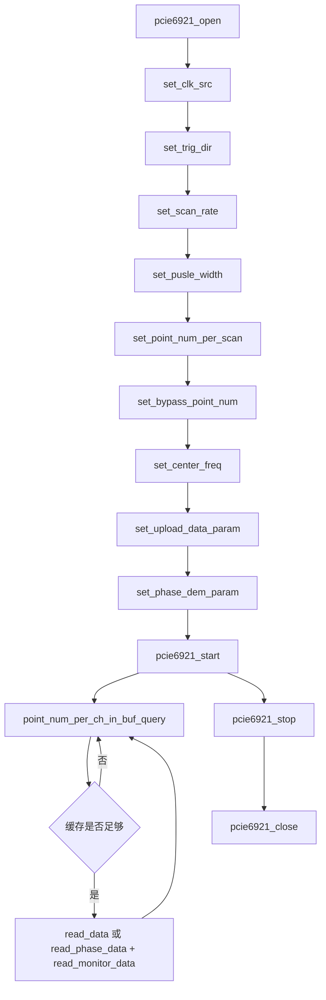
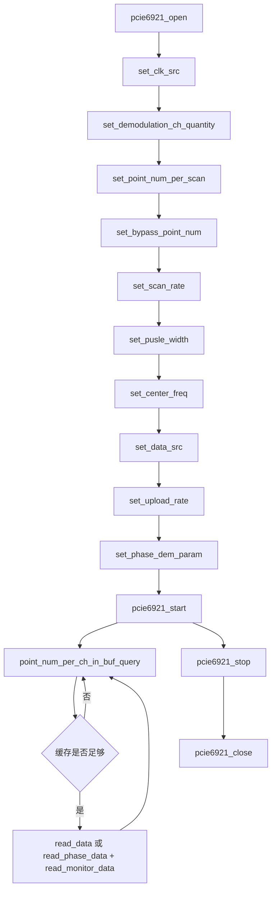

# PCIe6921和6921 API调用流程和方式对比

## 1. 文档目的

本文档用于支撑 `PCIe-6921` 上位机方案设计，目标是把 `PCIe-6921` 已落地 GUI 项目的硬件接口层迁移风险提前说清楚。本文重点回答三件事：

1. `PCIe-6921` 现有上位机是怎样组织采集流程的。
2. `PCIe-6921` 与 `PCIe-6921` 在 DLL 接口、参数语义、数据读取方式上的关键差异是什么。
3. 如果保持 `7821` 的 GUI、数据流、线程模型和软件架构不变，`6921` 的硬件适配层应当如何重新设计。

## 2. 分析依据

本次分析基于以下材料：

- `E:\codes\PCIe-6921\pcie6921_gui\src\` 下的现有上位机源码，重点关注 `main_window.py`、`acquisition_thread.py`、`pcie6921_api.py`、`config.py`。
- `E:\codes\PCIe-6921\doc\PCIe6921 API 相关手册.md`。
- `E:\codes\PCIe-6921\doc\API_User_Guide\PCIe6921-API DLL接口函数说明.pdf`。
- `E:\codes\PCIe-6921\doc\API_User_Guide\PCIe6921 API调用流程图.pdf`。
- `E:\codes\PCIe-6921\windows_issue\dll\pcie6921_api.h` 与 `pcie6921_api.dll` 导出表。
- `E:\codes\PCIe-6921\doc\API_User_Guide\PCIe6921-API DLL接口函数说明.pdf`。
- `E:\codes\PCIe-6921\doc\API_User_Guide\PCIe6921-API调用流程图.pdf`。
- `E:\codes\PCIe-6921\windows_Issue\dll\pcie6921_api.h` 与 `pcie6921_api.dll` 导出表。

## 3. 7821项目现状理解

### 3.1 软件架构

`PCIe-6921` 上位机当前已经形成稳定的软件分层：

- `main_window.py` 负责 GUI、参数收集、状态机、保存控制、显示刷新、TCP 转发协同。
- `acquisition_thread.py` 负责后台轮询缓冲区、读数、生成完整数据块、维护最新显示快照。
- `pcie6921_api.py` 负责 `ctypes` 原型声明、4 KB DMA 对齐缓冲区、错误码封装与 DLL 串行调用保护。
- `data_saver.py` 负责完整数据块异步落盘。
- `time_space_plot.py`、`spectrum_analyzer.py`、`tcp_tab3` 等模块消费采集线程输出。

因此，`7821 -> 6921` 的迁移本质不是推倒重写 GUI，而是把设备适配边界从 `PCIe6921API` 替换为 `PCIe6921API`，同时修正参数模型和校验规则。

### 3.2 7821的实际调用链

`7821` 在工程中的实际流程与厂家流程图一致，可归纳为：

### 3.3 7821接口设计特征

`7821` 的 API 设计有四个明显特征：

- 触发方向是显式配置项，`set_trig_dir` 决定板卡是接收外触发还是主动输出触发。
- 上传通道数、上传数据源、上传速率被捆绑在 `set_upload_data_param(upload_ch_num, upload_data_src, upload_data_rate)` 里一次性配置。
- `phase_dem` 输入速率与上位机上传速率不是同一个参数。`set_phase_dem_param` 的第一个参数 `data_rate2phase_dem` 单独控制进入相位解调单元的数据率。
- 原始数据与相位数据的读取函数分离，但都依赖 `point_num_per_ch_in_buf_query` 做缓冲区门限控制。

## 4. 6921的API调用流程

### 4.1 厂家流程图对应的调用顺序

根据 `PCIe6921-API调用流程图.pdf` 与 `PCIe6921-API DLL接口函数说明.pdf`，`6921` 的推荐流程如下：

### 4.2 6921的关键接口集合

从 `pcie6921_api.h` 和 `pcie6921_api.dll` 导出表可确认，`6921` 暴露的硬件接口为：

- `pcie6921_open`
- `pcie6921_close`
- `pcie6921_set_clk_src`
- `pcie6921_set_demodulation_ch_quantity`
- `pcie6921_set_point_num_per_scan`
- `pcie6921_set_bypass_point_num`
- `pcie6921_set_scan_rate`
- `pcie6921_set_pusle_width`
- `pcie6921_set_center_freq`
- `pcie6921_set_data_src`
- `pcie6921_set_upload_rate`
- `pcie6921_set_phase_dem_param`
- `pcie6921_point_num_per_ch_in_buf_query`
- `pcie6921_read_data`
- `pcie6921_read_phase_data`
- `pcie6921_read_monitor_data`
- `pcie6921_start`
- `pcie6921_stop`
- `pcie6921_test_wr_reg`
- `pcie6921_test_rd_reg`

### 4.3 6921的参数语义

`6921` 在文档中的语义要点如下：

- `set_clk_src`：`0=外部参考时钟`，`1=内部参考时钟`。
- `set_demodulation_ch_quantity`：配置参与 IQ 或 phase 解调的通道数，仅支持 `1` 或 `2`。
- `set_point_num_per_scan`：
  - 上传 `2` 通道原始数据，或上传 `1` 路解调后的 `I/Q`、`arctan`、`sqrt` 数据时，最大 `131072`，且要求 `256` 点对齐。
  - 上传 `2` 路解调后的 `I/Q`、`arctan`、`sqrt` 数据时，最大 `65536`，且要求 `128` 点对齐。
  - 上传 `phase` 数据时，最大 `65536`，无整数倍要求。
- `set_bypass_point_num`：允许 `0/1/2/3...` 的逐点旁路，不再要求 `4` 点对齐。
- `set_scan_rate`：设置激光脉冲频率。
- `set_pusle_width`：设置触发脉冲高电平宽度，要求 `4 ns` 整数倍，最小 `4 ns`。
- `set_center_freq`：使用 IQ 或 phase 解调时设置中心频率，文档示例主要以 `80 MHz` 系统为主。
- `set_data_src`：`0=raw`，`2=I/Q`，`3=arctan + sqrt`，`4=phase`。
- `set_upload_rate`：统一设置上传到 PC 的数据率，以及进入 `phase_dem` 单元的数据率。支持 `1~5`，对应 `250M/125M/83.33M/62.5M/50M`。
- `set_phase_dem_param(space_avg_order, space_merge_point_num, space_region_diff_order, detrend_filter_bw, polarization_diversity_en)`：不再单独传入 `data_rate2phase_dem`。

## 5. 7821与6921的核心差异

### 5.1 接口级差异总表

| 对比项 | PCIe-6921 | PCIe-6921 | 迁移影响 |
|---|---|---|---|
| 时钟源编码 | `0=内部, 1=外部` | `0=外部, 1=内部` | 不能直接复用枚举值，必须重新映射 |
| 触发方向接口 | 有 `set_trig_dir` | 无该接口 | GUI 中触发方向控件可能仅能保留展示，不应继续直通 DLL |
| 上传通道配置 | `set_upload_data_param(upload_ch_num, src, rate)` | `set_demodulation_ch_quantity` + `set_data_src` + `set_upload_rate` | 需要拆分配置逻辑与参数校验逻辑 |
| phase_dem 输入速率 | `set_phase_dem_param` 首参单独传入 | 由 `set_upload_rate` 统一控制 | `rate2phase` 相关 GUI 和配置语义需要重定义 |
| 原始数据上传形态 | 支持 1 通道、2 通道原始数据 | 文档仅给出 2 通道原始数据上传 | Raw 模式的通道数校验要重写 |
| 四通道模式 | 支持 4 通道 `I/Q` 或 `arctan/sqrt` | 不支持 | GUI 上与 4 通道相关的可选项要禁用或隐藏 |
| bypass 点数约束 | 必须是 `4` 的整数倍 | 可按 `1` 点步进 | 参数校验器要区分机型 |
| upload rate 选项 | `1,2,4,8,12,16,20,24,28,32`，覆盖 `1GSps` 到 `31.25MSps` | `1~5`，覆盖 `250M` 到 `50M` | GUI 速率下拉框和数据率换算公式要改 |
| diff 阶数约束 | 文档给出 `1~32` | 文档给出 `1~8` | `phase_dem` 参数范围要缩紧 |
| DLL 位宽 | 工程内现用 64 位 `7821` DLL | 用户指定路径是 `x86` DLL，同时存在 `x64` DLL | Python 运行位宽与 DLL 位宽必须严格匹配 |

### 5.2 触发与时序控制差异

`7821` 明确区分外触发输入和板卡触发输出，因此：

- 当 `trig_dir=输入` 时，`set_scan_rate`、`set_pusle_width` 可以不调用。
- 当 `trig_dir=输出` 时，这两个参数决定板卡发出的脉冲频率与宽度。

`6921` 文档和头文件中没有 `set_trig_dir`，流程图直接要求：

- `set_scan_rate`
- `set_pusle_width`

这说明 `6921` 上位机迁移时应采取更保守的工程假设：

- 先按“板卡主动产生激光脉冲”的模式实现。
- 原 `7821` GUI 中的触发方向控件不应未经论证直接保留为可写硬件参数。
- 若现场必须支持外部触发，需要额外确认 `6921` 是否有未公开接口或驱动级控制位，不能从 `7821` 逻辑直接迁移。

### 5.3 数据路径配置差异

`7821` 的数据路径配置方式是：

$$
\text{上传路径} = f(\text{upload\_ch\_num}, \text{upload\_data\_src}, \text{upload\_data\_rate}, \text{polarization})
$$

`6921` 的数据路径配置方式则变为：

$$
\text{上传路径} = f(\text{demodulation\_ch\_quantity}, \text{data\_src}, \text{upload\_rate}, \text{polarization})
$$

这意味着：

- `7821` 把“上传通道数”作为主配置项。
- `6921` 把“解调通道数”作为主配置项。
- `6921` 中 Raw 模式与解调模式不再共用完全相同的通道抽象。

从软件设计角度看，`6921` 需要引入一层“设备能力到 GUI 选项”的映射，而不是把 GUI 下拉框的值直接写给 DLL。

### 5.4 phase_dem 速率模型差异

`7821` 中：

- `upload_data_rate` 控制上传到 PC 的 raw、I/Q、arctan、sqrt 数据率。
- `data_rate2phase_dem` 单独控制进入 `phase_dem` 的输入速率。

`6921` 中：

- `upload_rate` 既控制上传到 PC 的 raw、I/Q、arctan、sqrt 数据率。
- 也同时控制进入 `phase_dem` 的输入速率。

因此 `6921` 里相位数据的空间分辨率换算应改写为：

$$
\Delta x_{phase} = \Delta x_{upload\_rate} \times \text{space\_merge\_point\_num}
$$

其中：

- `upload_rate=1` 时，单点空间距离约为 `0.4 m`
- `upload_rate=2` 时，单点空间距离约为 `0.8 m`
- `upload_rate=3` 时，单点空间距离约为 `1.2 m`
- `upload_rate=4` 时，单点空间距离约为 `1.6 m`
- `upload_rate=5` 时，单点空间距离约为 `2.0 m`

相比之下，`7821` 的相位输入速率是独立参数，软件上可以把“显示上传速率”和“phase_dem 输入速率”分开调优。`6921` 则收敛成单一速率控制，GUI 与配置模型都应同步收敛。

### 5.5 点数约束差异

`7821` 的 `point_num_per_scan` 约束与通道数绑定更紧：

- 单通道 raw 或解调：最大 `262144`，`512` 点对齐。
- 双通道 raw 或解调：最大 `131072`，`256` 点对齐。
- 四通道解调：最大 `65536`，`128` 点对齐。
- phase：最大 `65536`，无整数倍要求。

`6921` 的约束更像“按数据路径分类”：

- `2` 通道 raw，或 `1` 路解调结果上传：最大 `131072`，`256` 点对齐。
- `2` 路解调结果上传：最大 `65536`，`128` 点对齐。
- phase：最大 `65536`，无整数倍要求。

这对 GUI 校验的影响很直接：原先 `7821` 代码中的 `validate_point_num(channel_num, data_source)` 规则，不能仅替换设备名后继续使用。

### 5.6 监测数据和相位读取方式

两者在以下方面保持一致：

- `phase` 用 `read_phase_data` 读取，类型为 `int32`。
- `monitor` 用 `read_monitor_data` 读取，类型为 `uint32`。
- 相位和监测数据缓冲区都要求 `4096` 字节对齐。
- `read_phase_data` 的 `point_num_per_ch` 都应是 `point_num_per_scan / space_merge_point_num` 的整数倍。

但 `6921` 文档给出的 `space_region_diff_order` 范围更小，仅 `1~8`，这说明 `phase_dem` 参数上限比 `7821` 更保守，不能直接照搬历史参数集。

### 5.7 时钟源编码反转

这是最容易被忽略、但最可能导致现场误采集的差异：

- `7821`：`0=内部参考时钟`，`1=外部参考时钟`
- `6921`：`0=外部参考时钟`，`1=内部参考时钟`

如果沿用 `7821` 的枚举值不做转换，那么用户在 GUI 上看到“内部时钟”时，底层可能实际写入“外部时钟”，设备会表现为不起采或时钟异常。

因此，时钟源枚举绝不能继续复用旧值，必须做设备专属映射层。

## 6. 6921推荐的软件调用方式

为了保持 `7821` 工程的 GUI、线程和数据流不变，建议把 `6921` 的上位机调用方式设计为下面三层。

### 6.1 设备无关参数层

对 GUI 保持统一参数语义，例如：

- `clock_source`
- `scan_rate`
- `pulse_width_ns`
- `point_num_per_scan`
- `data_source`
- `demod_channel_count`
- `upload_rate`
- `phase_merge_point_num`
- `phase_diff_order`
- `detrend_filter_bw`
- `polarization_diversity_en`

这一层只表达业务含义，不直接等于 DLL 参数值。

### 6.2 设备适配映射层

在 `PCIe6921API` 或单独的 mapper 中完成参数翻译：

- GUI `内部时钟` 映射为 `6921` 的 `1`
- GUI `外部时钟` 映射为 `6921` 的 `0`
- GUI `Phase` 模式映射为 `set_data_src(4)`
- GUI `单通道解调` 映射为 `set_demodulation_ch_quantity(1)`
- GUI `双通道解调` 映射为 `set_demodulation_ch_quantity(2)`
- GUI `显示速率选项` 映射为 `set_upload_rate(1~5)`

### 6.3 实际执行层

建议固化为以下顺序：

1. `open`
2. `set_clk_src`
3. `set_demodulation_ch_quantity`，仅在 `I/Q`、`arctan/sqrt`、`phase` 模式下有效
4. `set_point_num_per_scan`
5. `set_bypass_point_num`
6. `set_scan_rate`
7. `set_pusle_width`
8. `set_center_freq`，仅在非 raw 模式下执行
9. `set_data_src`
10. `set_upload_rate`
11. `set_phase_dem_param`，仅在 phase 路径下需要严格校验其参数组合
12. `start`
13. `query -> read`
14. `stop`
15. `close`

## 7. 对7821现有代码迁移的直接影响

### 7.1 可以基本保持不变的部分

以下部分原则上可以保持 `7821` 的架构与实现习惯：

- PyQt GUI 布局与 Tab 结构
- 采集线程与 GUI 主线程分离的模式
- “完整数据块”和“最新显示快照”分流的设计
- 异步写盘线程与 TCP 发送线程
- Time-Space 图、频谱显示、原始数据显示控件
- 4 KB 对齐缓冲区分配策略
- `query_buffer_points -> 足量后读取` 的采集循环

### 7.2 必须重写或显著调整的部分

以下部分不建议直接复制 `7821`：

- `config.py` 中的通道数、时钟源、数据率、`rate2phase` 选项枚举
- `validate_point_num` 的点数和对齐规则
- `pcie6921_api.py` 的原型声明和配置接口封装
- `main_window.py` 中把 GUI 通道数直接写入 `set_upload_data_param` 的逻辑
- `phase_dem` 参数 UI 的提示文案和合法范围
- 触发方向相关控件的有效性控制

### 7.3 高风险兼容点

以下兼容点在正式编码前必须明确：

- 用户指定的 `x86` DLL 不能被当前 64 位 Python 解释器直接装载。若最终上位机仍运行在 64 位 Python，需要改用 `E:\codes\PCIe-6921\windows_Issue\dll\x64\pcie6921_api.dll`。
- `6921` 不存在 `set_trig_dir`，因此原 GUI 中“触发输入/输出”选项不能假定仍然有效。
- `6921` 的 Raw 模式文档只给出双通道原始数据交织形式，不能假定支持 `7821` 的单通道 Raw 上传方式。
- `6921` 的 `upload_rate` 与 `phase_dem` 速率绑定后，原 GUI 中 `upload_data_rate` 与 `rate2phase` 分别设置的交互逻辑需要重构。

## 8. 结论

`PCIe-6921` 与 `PCIe-6921` 在数据读取主流程上保持同类设备的一致性，都是“初始化参数 -> start -> 轮询缓存 -> 读取数据 -> stop -> close”的模式，因此 `7821` 现有 GUI 和线程架构具有较强复用价值。

但两者在“参数语义层”并不兼容，尤其体现在：

- 时钟源编码相反
- 触发方向接口消失
- 上传通道配置被拆分
- phase_dem 输入速率模型改变
- 点数与对齐规则改变
- 速率枚举范围改变

因此，`6921` 上位机开发不应按“替换 DLL 名称”处理，而应按“复用 `7821` 上层架构，重写 `6921` 硬件适配层和参数校验层”处理。
